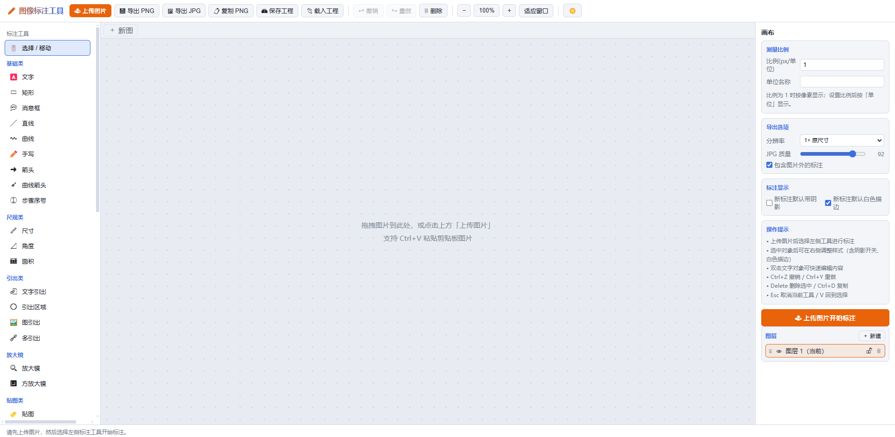

<div align="center">

# 🖍️ Image Annotation Tool

### 图像标注工具 · 纯前端 · 零安装 · 离线可用

**一个开箱即用的浏览器标注工具：打开一个 HTML 文件，就能在图片上画箭头、写注释、量尺寸、打马赛克。**

打开 `index.html` 即可使用，无需安装、无需服务器、无需联网——数据全程留在本地。

[](LICENSE)
[](index.html)
[](使用说明.md)
[](vendor/fabric.min.js)
[](使用说明.md)
[](#-测试)
[](使用说明.md)

</div>

<div align="center">



</div>

---

## 📖 目录

- [✨ 特性](#-特性)
- [🎨 工具一览](#-工具一览)
- [🚀 快速开始](#-快速开始)
- [⌨️ 快捷键](#-快捷键)
- [🧪 测试](#-测试)
- [📁 项目结构](#-项目结构)
- [📚 文档](#-文档)
- [🤝 贡献](#-贡献)
- [📄 许可证](#-许可证)

---

## ✨ 特性

| | 特性 | 说明 |
| --- | --- | --- |
| 🖼️ | **无限画布** | 滚轮缩放、空格/中键平移；图片之外也能自由标注 |
| 🗂️ | **图层系统** | 每个标注自动建层，支持排序 / 显隐 / 锁定；图层操作全部可撤销 |
| 🎯 | **可编辑标注** | 曲线、箭头、文字引出、多引出、引出区域等都带可拖动的控制点，画完还能改 |
| 💾 | **全局样式记忆** | 线条 / 文字 / 图形 / 阴影的默认样式自动保存，下次打开自动恢复 |
| 📤 | **多格式导出** | PNG（图片外透明）/ JPG（质量可调）/ 一键复制 PNG 到剪贴板 |
| 🗔 | **多图标签页** | 同时打开多张图片，每张的标注、图层、历史、马赛克各自独立 |
| ↩️ | **智能撤销** | 快照瘦身（马赛克 dataURL 去重），历史不随涂抹增长而膨胀 |
| 🌗 | **主题切换** | 暗色 / 亮色平滑过渡，动效适配系统「减少动态效果」 |
| 🪟 | **Windows 7 兼容** | Chrome 109+ / Firefox 115 ESR+ / Edge 109+ 均可用 |
| 🔒 | **隐私友好** | 完全本地运行，图片与标注数据不出本机 |

## 🎨 工具一览

| 分类 | 工具 |
| --- | --- |
| **基础类** | 文字 · 矩形 · 消息框 · 直线 · 曲线（锚点可拖动）· 手写 · 箭头（端点可拖动）· 曲线箭头 · 步骤序号 |
| **尺规类** | 尺寸（长度测量）· 角度（三点测角）· 面积（多边形面积） |
| **引出类** | 文字引出 · 引出区域 · 图引出 · 多引出 |
| **视图类** | 圆形放大镜 · 方形放大镜 · 贴图（48 种表情 + 自定义）· 马赛克 |

每个标注的**颜色、线宽、线形、圆角、填充、阴影、白色描边**都能在右侧面板单独调整；文字还支持字体、字距、粗斜体、下划线、轮廓。

## 🚀 快速开始

1. **下载** 本仓库（或仅下载 `index.html` + `vendor/` + `css/` + `js/`）
2. **打开** `index.html` —— 无需服务器，双击即可
3. **标注** —— 上传图片（或拖入 / `Ctrl+V` 粘贴），在左侧选择工具开画

> 💡 也支持 **Ctrl+V 粘贴剪贴板图片**、**拖拽图片到画布**、**保存/载入工程 JSON**（Chrome/Edge 保存时会弹出「另存为」对话框）。

<div align="center">

**操作演示**


</div>

## ⌨️ 快捷键

| 按键 | 功能 |
| --- | --- |
| `Ctrl+Z` / `Ctrl+Y` | 撤销 / 重做 |
| `Delete` | 删除选中对象 |
| `Ctrl+D` | 复制选中对象 |
| `Ctrl+S` | 保存工程 |
| `Ctrl+E` | 导出 PNG |
| `方向键` | 1px 微调（`Shift` 为 10px） |
| `Esc` | 取消当前工具 |
| `V` | 回到「选择 / 移动」 |
| `空格` + 拖拽 / 中键拖拽 | 平移画布 |

## 🧪 测试

仓库内置 Node 测试套件（无需浏览器）：

```bash
node test-verify.js       # 对象库 API 验证
node test-render.js       # 渲染与序列化集成测试
node test-tools.js        # 工具交互集成测试
node test-app-smoke.js    # app.js 冒烟测试（多图标签页 / 历史 / 导出选项 / 拖动回归）
```

## 📁 项目结构

```
├── index.html            页面入口（唯一入口，双击即用）
├── css/style.css         界面样式（含暗色/亮色主题变量）
├── js/
│   ├── objects.js        自定义标注对象（文字/矩形/引出/测量/放大镜等 15 类）
│   ├── tools.js          工具手势交互与马赛克图层
│   └── app.js            面板、历史记录、导出、工程存取、快捷键、多图标签页
├── vendor/
│   └── fabric.min.js     Fabric.js 5.5.2（本地依赖，离线可用）
├── docs/
│   ├── screencut.png     README 界面截图
│   └── demo.gif          README 操作演示 GIF
├── test-*.js             Node 测试套件（4 个）
└── 使用说明.md            完整使用文档
```

## 📚 文档

完整的功能说明、交互细节与兼容性说明见 **[使用说明.md](使用说明.md)**。

## 🤝 贡献

欢迎提交 Issue 与 Pull Request！

- 🐛 发现 Bug：请附上**操作步骤**与**浏览器版本**
- 💡 新功能建议：说明使用场景即可
- 提交代码前请运行 `node test-verify.js` 与 `node test-app-smoke.js` 确认测试通过

## 📄 许可证

[MIT](LICENSE) © 2026 bovins
